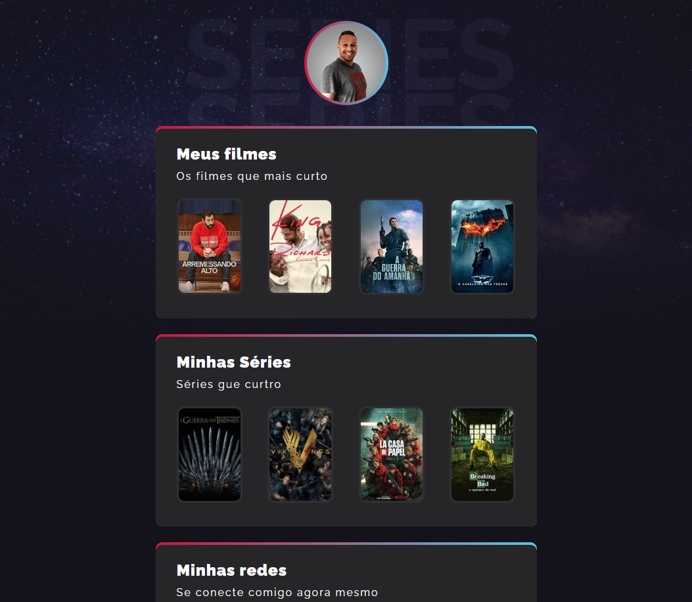

# NLW eSports

> Trilha Explorer

Projeto construído do evento Next Level Week da Rockseat

[Clique aqui para acessar](http://deivison.novossate.github.io/nlw-explorer-eSports)

## Technologies

- HTML
- CSS
- Git e Github

## Project challenges

Resultados de tradução
The week of Next Level Week.
This page was developed based on eSports.
Rockseat instructor Mayk Brito proposed that we redo the project and add movies and series that we like.

I redid the project and arrived at this beautiful result.
During the structure process I came across some challenges for example:
- How to make the gradient in css
- How to apply hover on cards
- How to apply animations and properties (This was new to me).

With everything I ended up discovering that we can have different paths to the same goal. I didn't have to be totally stuck with what I learned, I could see my evolution and I'm loving learning to program even more.

## Desafios do Projeto
Na semana do Next Level Week.
Foi desenvolvido essa uma página baseada no eSports.
Instrutor Mayk Brito da Rockseat propós que refizemos o projeto e adicionacemos filmes e series que gostamos.

Refiz o projeto cheguei nesse lindo resultado.
Durante o processo da estrutura me deparei com alguns desafios por exemplo: 
- Como fazer o gradiente no css
- Como aplicar o hover nos cards
- Como aplicar as animation e as propriedas (Isso foi novo para mim).

Com tudo acabei descobrindo que podemos ter caminhos diferentes para o mesmo objetivo. Não precisei ficar totalmente preso ao que aprendi, pude percerber a minha evolução e estou amando aprender a programar ainda mais.

## Contact

deivisonnra@gmail.com

